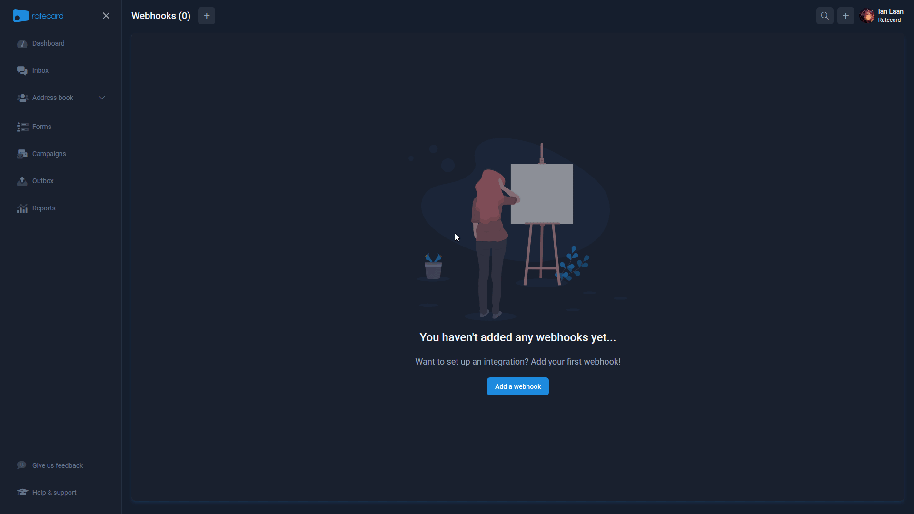
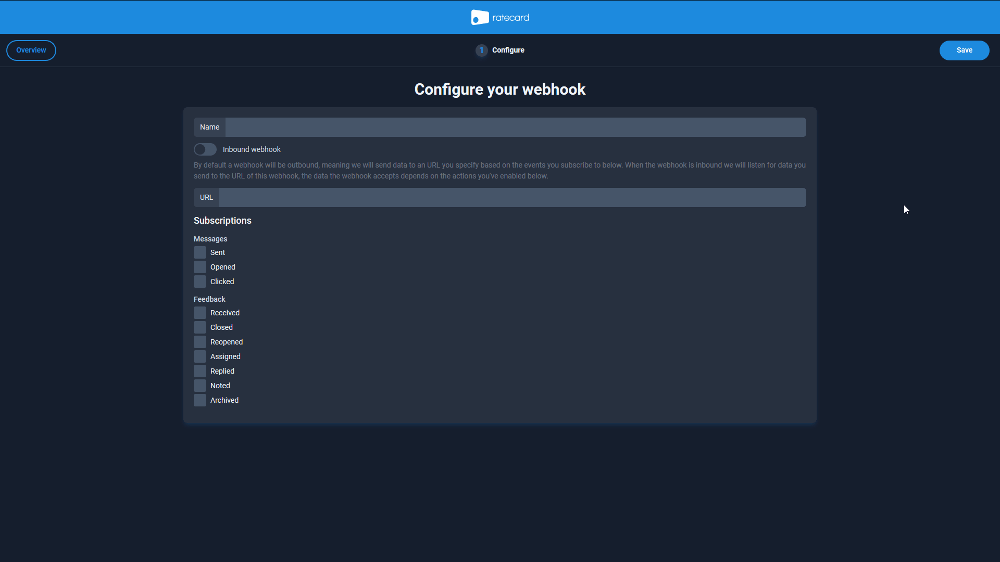
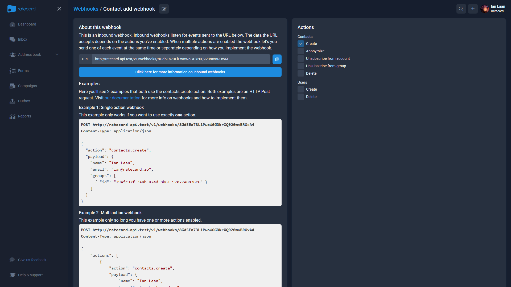
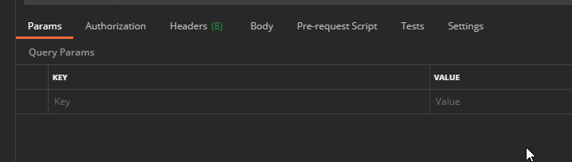
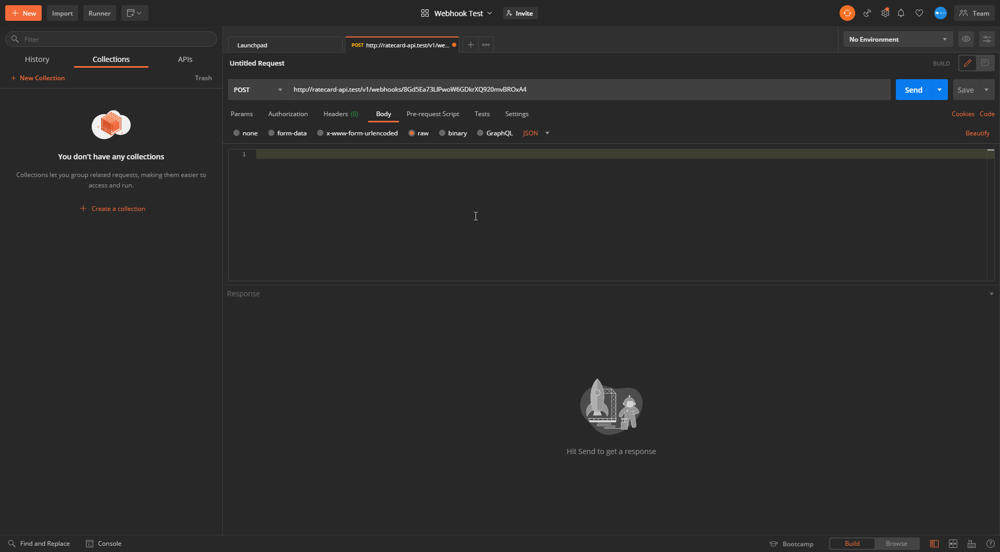

# Inbound Webhooks: How to use
In this article you'll learn how to use our inbound webhooks.

## 1. What is an inbound webhook?
_If you already know what an inbound webhook is feel free to go to step 2._

## 2. How to create an inbound webhook?
In this section you'll learn how to create an inbound webhook.

### 2.1 Prepare an environment to test the webhooks in
It is recommended that you have an environment for testing the webhooks in advance. We'll use [Postman](https://www.postman.com/) to test the webhooks by catching the POST requests.

### 2.2 Create the inbonud webhook
There's 2 wasy to create the inbound webhook. Via our api or in our app. 

#### 2.2.1 Creating an outbound webhook in Ratecard
First we'll navigate to [Webhooks](https://ratecard.io/app/webhooks) in the app. Next we'll click on 'Add a webhook' if there's no webhook yet in the application or on the plus button next to the title.

For this example name the webhook 'Contact add webhook' and select the `contact.create` action below.

After creating your webhook you'll land on the webhook's show page which contains an example for contacts create, links to the documentation, show the url you need to post to and the actions you've enabled.

#### 2.2.2 Creating an outbound webhook via the API
The article will soon be updated with this step included.
## 3. Verify that the webhook works
Now that you have a configured webhook and environment to test it, let's post some data towards Ratecard! To begin, copy your webhook URL and create a new POST request in your environment. 

If you're using Postman like me, head over to the body tab, then click on the raw option and select JSON in the dropdown that shows up afterwards.
 

Now we're ready to add some JSON to our body. I will be using a slightly modified version of the contacts create example shown on the [actions](./actions.md) page since `johndoe@example.com` will not pass our email validation. After adding the example data to the request body press send. If everything goes right you should see a response with a message that says: _"The webhook call is scheduled for processing."_. 
> This means that the data passed the initial validation and that a job has been scheduled to handle the processing.

Head back to [Ratecard](https://ratecard.io/app) and press `CTRL + S` to open the search, then type in the name or email of your contact, and click on them if they show up. If you don't see your contact, verify that your payload contains valid data. When the contact details is loaded you should be able to see the text "synced via Webhook" with a webhook icon.

<!-- theme: warning -->
> Currently you're unable to see whether the job could successfully process the payload or not since inbound webhooks are processed in a job queue. In the future you will be able to see this in the app and through the API when we add the webhook call log. When something doesn't show up in our app you can assume it failed to pass validation within the job.

## 4. Congratulations 
You've successfully set up your inbound webhook and verified that it works. Now you can implement it in or connect it to your own apps.