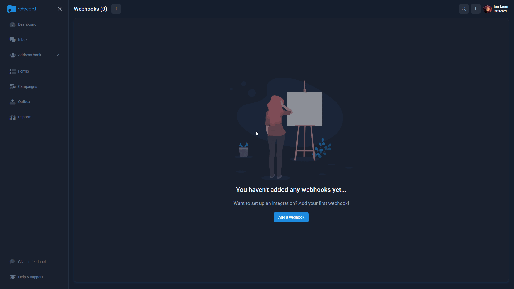
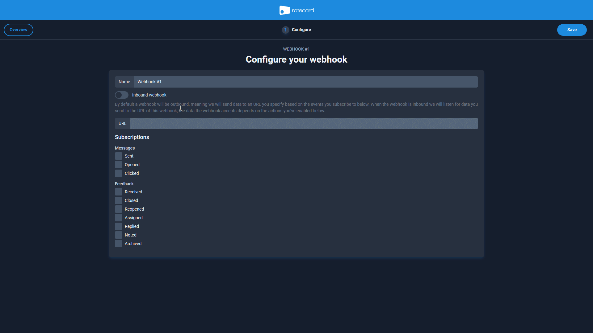
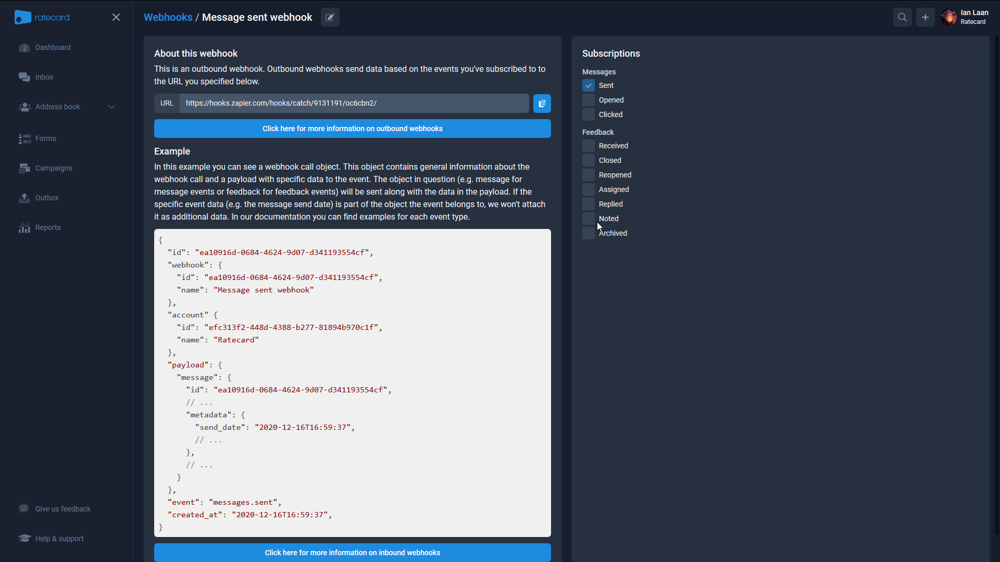
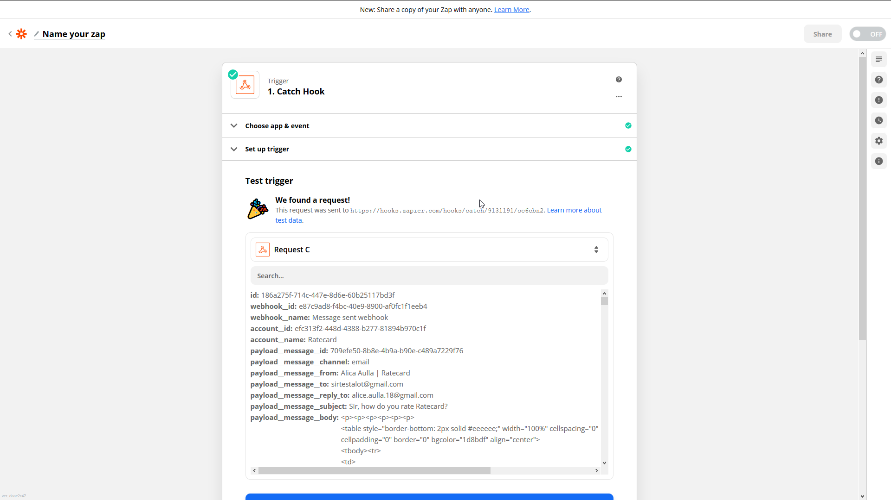

# Outbound Webhooks: How to use
In this article you'll learn how to use our outbound webhooks.

## 1. What is an outbound webhook?
_If you already know what an outbound webhook is feel free to go to step 2._

An outbound webhook listens for events that happen within our system. These events can be subscribed to via the API or in our app by creating a new webhook or modifying an existing one. Outbound webhooks require you to specify an URL where it can send the data to. We `POST` data in `JSON` format to the specified URL when one of the subscribed to events (e.g `messages.sent`) triggers.

[See all subscriptions (recommened to read at least once before continuing)](./subscriptions.md)

## 2. How to create an outbound webhook?
In this section you'll learn how to create an outbound webhook.
### 2.1 Prepare an URL where we can `POST` data to
It is recommended that you have an URL for testing the webhooks in advance. We'll use a [Zapier](https://zapier.com/apps/ratecard/integrations) webhook to test the webhooks by catching the POST requests.
### 2.2 Create the outbound webhook
There's 2 wasy to create the outbound webhook. Via our api or in our app. 
#### 2.2.1 Creating an outbound webhook in Ratecard
First we'll navigate to [Webhooks](https://ratecard.io/app/webhooks) in the app. Next we'll click on 'Add a webhook' if there's no webhook yet in the application or on the plus button next to the title.

For this example name the webhook 'Message sent webhook' and subscribe to `messages.sent` after entering the webhook URL.

After creating your webhook you'll land on the webhook's show page which contains an example for messages sent, links to the documentation, your url and subscriptions.

#### 2.2.2 Creating an outbound webhook via the API
The article will be updated soon with this step included.

## 3. Verify that the webhook works
> The how to use will fast forward the process of setting up groups and campaigns as it's intended to show how webhooks work.

Now that you have a configured webhook and your process is up and running, let's listen for events. If everything is set up works as expected you should be receiving data very soon and if you're also using Zapier you might see a response like the following appear when testing your trigger:

## 4. Congratulations 
You've successfully set up your outbound webhook. Now let the events do their magic!